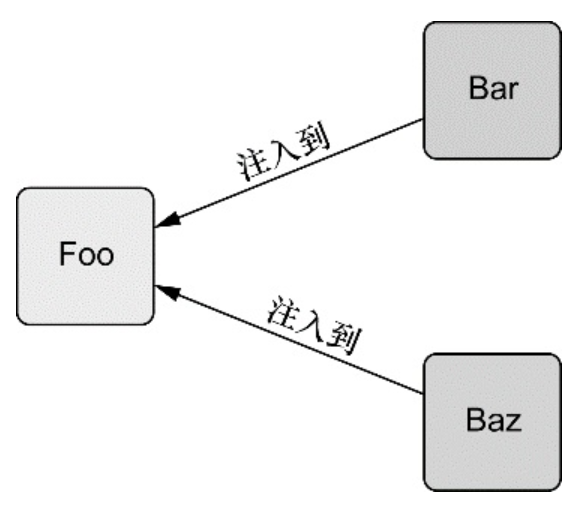
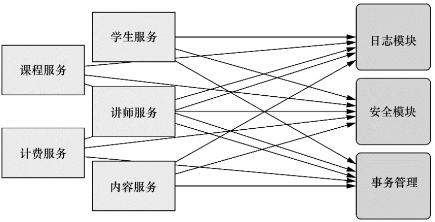
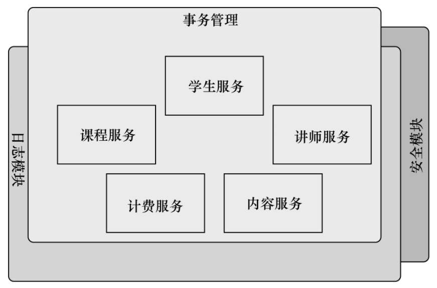
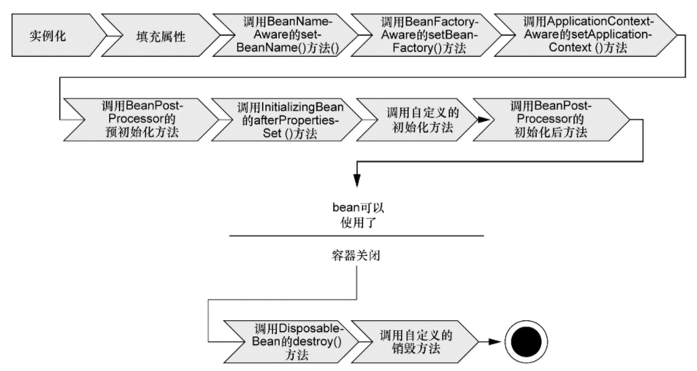
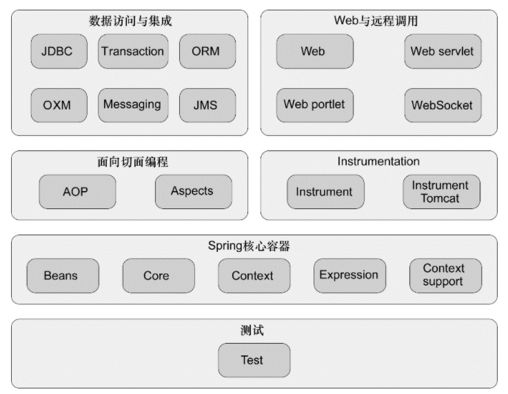

## Spring 特色

### 依賴注入

``` Java
public class DamselRescuingKnight implements Knight {

  private RescueDamselQuest quest;

  public DamselRescuingKnight() {
    this.quest = new RescueDamselQuest();
  }

  public void embarkOnQuest() {
    quest.embark();
  }
  
}
```

範例中舉了騎士類別這個例子，在建構子就已經決定了它的任務實體，這樣極大限制騎士類別的探險方式，如果它要做的是屠殺惡龍、或是探索迷宮......，那就得重新翻寫，另一點是必須保證騎士的 `embarkOnQuest(..)` 方法被呼叫時，探險的 `embark(..)` 方法也要被呼叫。但沒有一個簡單的方式可以實現這一點。

耦合是個一體兩面的東西，高度耦合的程式碼難以閱讀、測試及維護，但沒有任何耦合的程式碼卻什麼也做不了，因此只能盡量降低程式碼的耦合性，實體會改成以注入的方式來實踐 : 



程式碼會改成以下的形式 :

``` Java
public class BraveKnight implements Knight {

  private Quest quest;

  public BraveKnight(Quest quest) {
    this.quest = quest;
  }

  public void embarkOnQuest() {
    quest.embark();
  }

}
```

這邊的 `Knight` 及 `Quest` 都是 interface，範例中是使用了建構子來進行注入，因此任何 `Quest` 的實體都必須實作 `Quest`，而任何一個 `Knight` 都必須實作 `Knight`，這樣除了保持程式碼的彈性，也讓測試方便許多 :

``` Java
import static org.mockito.Mockito.*;

import org.junit.Test;

import sia.knights.BraveKnight;
import sia.knights.Quest;

public class BraveKnightTest {

  @Test
  public void knightShouldEmbarkOnQuest() {
    Quest mockQuest = mock(Quest.class);
    BraveKnight knight = new BraveKnight(mockQuest);
    knight.embarkOnQuest();
    verify(mockQuest, times(1)).embark();
  }

}
```

而在 Spring 中除了依靠 xml，也可以使用 `@Configuraiton` 來當作注入的配置 ( wiring ) :

``` Java
@Configuration
public class KnightConfig {

  @Bean
  public Knight knight() {
    return new BraveKnight(quest());
  }
  
  @Bean
  public Quest quest() {
    return new SlayDragonQuest(System.out);
  }

}
```

``` Java
public class SlayDragonQuest implements Quest {

  private PrintStream stream;

  public SlayDragonQuest(PrintStream stream) {
    this.stream = stream;
  }

  public void embark() {
    stream.println("Embarking on quest to slay the dragon!");
  }

}
```

### AOP



在圖片中有五個核心業務 ( 學生服務、課程服務、講師服務 、內容服務、計費服務 )，而它們都會依賴到另外三個模組 ( 日誌模組、安全模組、事務管理 )，這樣的程式設計上就會出現許多相同的程式碼，因此會將這些程式碼抽出來，運用 AOP 的概念去使用它 :



而在 Spring 中運用 xml 配置 AOP 的方式這邊就不提。

### 模板消除重複程式碼

最常見的例子就是 JDBC 連線設定 :

``` Java
public Employee getEmployeeById(long id) {
  
  Connection conn = null;
  PreparedStatement stmt = null;
  Result rs = null;
  
  try {
    conn = dataSource.getConnection();
    stmt = conn.prepareStatment(
      "select id, firstname, lastname, salary from " +
      "employee where id=?");
    stmt.setLong(1, id);
    rs = stmt.executeQuery();
    Employee employee = null;
    if (rs.next()) {
      employee = new Employee();
      employee.setId(rs.getLong("id"));
      employee.setFirstName(rs.getString("firstname"));
      employee.setLastName(rs.getString("lastname"));
      employee.setSalary(rs.getBigDecimal("salary"));
    }
    return employee;
  } catch (SQLException e) {
  } finally {
    if (rs != null) {
      try {
        rs.close();
      } catch (SQLException e) {
      }
    }
    
    if (stmt != null) {
      try {
        stmt.close();
      } catch (SQLException e) {
      }
    }
    
    if (conn != null) {
      try {
        conn.close();
      } catch (SQLException e) {
      }
    }    
  }
  return null;
}
```

這些程式碼在每一段有運用 JDBC 連線的程式碼都會寫到，因此在 Spring 中多出一個物件 `JDBCTemplate` 來處理這件事情，JMS、JNDI、REST 這些服務也具有這樣的特性，會有大量相同的程式碼出現，因此使用上 Spring 提供了 Template 物件，過去這些相同的程式碼全都被包在裡面。 

### `ApplicationContext`

Spring 是 IoC 的設計，也就是說有個物件來專門管理內部的 bean ( 這邊的 bean 所指的是 Java Bean，跟 `@Bean` 沒有關係 )，bean 生成、使用、管理全部都由內部的東西來幫忙處理，而處理這件事情的物件就是 `ApplicationContext` ( 然而它其實只是介面，有很多其他的物件去實作它，像是 `AnnotationConfigApplicationContext`、`AnnotationConfigWebApplicationContext`、`ClassPathXmlApplicationContext`、`FileSystemXmlapplicationcontext`、`XmlWebApplicationContext`...... )，下面幾個 `ApplicationContext` 的加載方式 :

``` Java
ApplicationContext context = new FileSystemXmlApplicationContext("c:/knight.xml");
ApplicationContext context = new ClassPathXmlApplicationContext("knight.xml");
ApplicationContext context = new AnnotationConfigApplicationContext(com.springinaction.knights.config.KnightConfig.class);
```

而如果想拿出內部的 bean，再使用 `getBean(..)` method 即可。

> 額外資料 : https://www.baeldung.com/spring-application-context

### Bean 的生命週期



1. Spring 對 bean 實例化
2. Spring 將值和 bean 的引用注入到 bean 對應的屬性中
3. 如果 bean 實作 `BeanNameAware` 介面，Spring 將 bean 的 ID 傳遞給 `setBeanName(..)`方法
4. 如果 bean 實作 `BeanFactoryAware` 介面，Spring 將呼叫 `setBeanFactory(..)` 方法，將 `BeanFactory` 容器實例傳入
5. 如果 bean 實作 `ApplicationContextAware` 介面，Spring 將呼叫 `setApplicationContext(..)` 方法，將 bean 所在的 `ApplicationContext` 引用傳入進來
6. 如果 bean 實作 `BeanPostProcessor` 介面，Spring 將呼叫它們的 `postProcessBefore-Initialization(..)` 方法
7. 如果 bean 實作 `InitializingBean` 介面，Spring 將呼叫它們的 `afterPropertiesSet(..)` 方法。另外如果 bean 使用 `initmethod` 宣告初始化方法，此方法也會被呼叫
8. 如果 bean 實作 `BeanPostProcessor` 介面，Spring 將呼叫它們的 `postProcessAfter-Initialization(..)` 方法
9. 此時 bean 就準備完成拿來使用，它們會一直留在 `ApplicationContext` 中，直到該 `ApplicationContext` 被銷毀
10. 如果 bean 實作 `DisposableBean` 介面，Spring 將呼叫它的 `destroy(..)` 方法

### Spring 模組以及其 Portfolio



Spring 框架本身提供了好幾個模組，整個區塊大致如上 :
* 核心容器 : 如同上面提到的 `BeanFactory` 以及 `ApplicationContext`，由它來管理所有 Bean 的生命週期跟取用的設定，

* AOP : 將遍布系統的關注點 ( 像是紀錄 log 或是安全性問題 ) 從他們所應用的物件中解耦出來。

* 數據訪問 : 過去使用 JDBC 的重複性模板語法改以 JDBCTemplate 來進行，並且使用 DAO 來獲取資料，而在原本的錯誤訊息 Spring 又進行了一層封裝，也因此會得到語意更加豐富明確的結果。
而如果是比較喜歡使用 ORM 架構的人，Spring 本身沒有自創 ORM 的架構，但幾乎支持所有其他的 ORM 架構，像是 Hibernate、Java Persisternce API、Java Data Object 和 iBATIS SQL Maps。

* Web && 遠程調用 ( Spring Remoting ) : Web 使用基本的 MVC 架構，遠程調用則用了 RMI（Remote Method Invocation）、Hessian、Burlap、JAX-WS，並且自帶 HTTP invoker 遠程調用框架。

* Instrumentation : 提供了為 JVM 添加代理（agent）的功能。使用場景較少
書中不會提。

* 測試 : Spring 為使用 JNDI、Servlet 和 Portlet 編寫測試單元提供了一系列的 mock 物件實現。

除了 Spring 外，Spring 家族還包含了其他內容 :

* Spring Web Flow
* Spring Web Service
* Spring Security
* Spring Integration
* Spring Batch
* Spring Data
* Spring Social
* Spring Mobile
* Spring for Android
* Spring Boot

